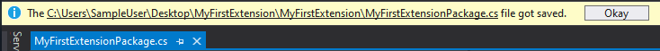

# Making your fist Extension with DulcisX

In this example you will learn how you make your first extension with this package. The extension will listen on File saves and will show a message upon the raise of this event.

## What will you learn?

- In this example you will learn how to hook callback methods to events which are provided by DulcisX.
- Using the Hierarchy system of the Visual Studio Solution Explorer.
- Displaying messages to the user in the InfoBar. 

## Step 1: Setting up the environment

If you have already installed the 'Visual Studio Extension development' module to Visual Studio, you can skip to Step 2.

Open up the Windows Search and enter 'Visual Studio Installer', next up identify your version of Visual Studio which you want to use for Extension development. After you have have identified your version you want to modify click on 'Modify' and scroll to the very bottom of the appearing window. If not already ticked, check the 'Visual Studio extension development' box and click on 'Modify' in the bottom right corner.

## Step 2: Creating the new Project

Now open up Visual Studio and click on 'Create a new project'. On the appearance of the window enter 'VSIX Project C#' and select the first result. Enter a name for your Project, in my case I'll use 'MyFirstExtension'. Next up open up the 'MyFirstExtensionPackage.cs' file, this is the heart of your extension.

## Step 3: Understanding the template

The `PackageRegistration` attribute tells Visual Studio that this is the entry point for your extension, where as the `Guid` attribute uniquely identifies the extension between all the others. 
The `InitializeAsync` method is the start of your application. It will get called after the package got loaded by the Visual Studio environment.

## Step 4: Configure the template

At the very top of your file add a using statement to `DulcisX.Core` and instead of inheriting from `Package`, inherit from `PackageX`. This will provide you access to all the DulcisX API's.
For now you can delete the `Package Members` region, as we will be using custom events from `PackageX`.

Add a constructor to your class in which we will append our file save event. Place the following code in your class:

[!code[Sample constructor](samples/constructor.cs)]

> [!NOTE]
> Normally in C# appending a callback method to an event is done with the `+=` operator, however for some events in DulcisX this is not the case. The file save operation can occur for different types of Nodes. Therefore the first parameter of the `.Hook` method restricts the Nodes which can invoke the provided callback. This ensures that the `IPhysicalNode` of the callback parameter is always of the type(s) passed as the first parameter.

Also you should add the `ProvideAutoLoad` attribute to your class, in order to allow your extension to be automatically loaded in the background by Visual Studio. This would look something like the folllowing.


```cs
[ProvideAutoLoad(VSConstants.UICONTEXT.SolutionExists_string, PackageAutoLoadFlags.BackgroundLoad)]
```

Additionally it will ensure that the extension is only loaded if a Solution exists.

## Step 5: Show the message upon File Save

`PackageX` exposes the `InfoBar` property which allows you to publish messages in the Visual Studio InfoBar. This package uses a Builder construct to construct the message, which would look something like the following. You should place this in the `OnDocumentSaved` callback method.

[!code[Sample message](samples/message.cs)]

This would result in something like you can see below.



### The full Code

Below you can see what we end up with, the code will of course differ to yours.

[!code[Full sample](samples/full-sample.cs)]

## Step 6: Start and Debug your Extension

You can just Start/Debug a Visual Studio Extension as any other .Net Application, by clicking 'Start' in Visual Studio. This will start a _Visual Studio Experimental_ instance which will not interfere with any current settings to your current Visual Studio settings. 

You will now want to open any project in which you want to test your extension. That's it, your first extension up and running. It wasn't that hard right?

> [!NOTE]
> If you click in the bottom left corner on the loading symbol, you can see the loading progress of your Extension. 

