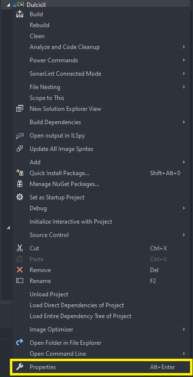
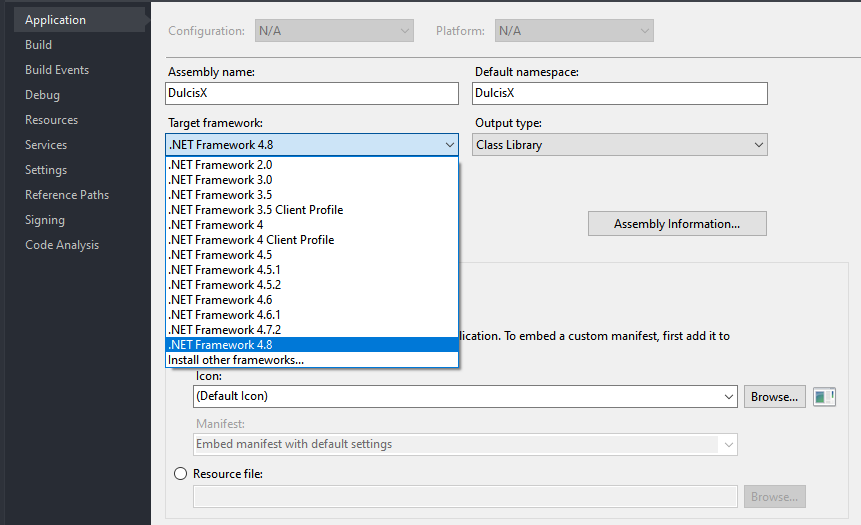
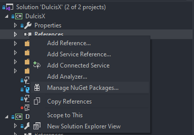
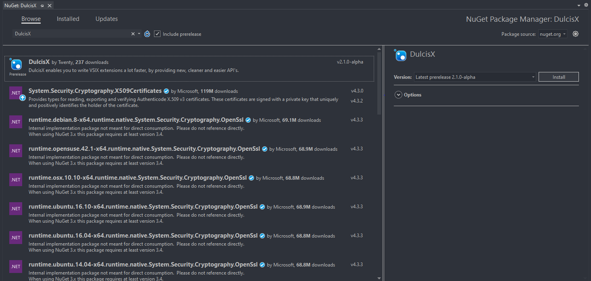

# DulcisX Installation

## Supported Platforms

DulcisX targets `.Net Framework 4.8`, that means that all projects which use this package need to target `.Net Framework 4.8` as well. Unfortunately the `VSIX Project` template targets `.Net Framework 4.7.2`, therefor you will need to change that.

### [Editing the .csproj properties page](#tab/property-page-edit)

1. Right click the Project file and click on 'Properties'
	
	
	
2. Select the 'Application' tab
3. Change the 'Target Framework' to `.Net Framework 4.7.2`. If you don't see that option, you can install it from [here](https://dotnet.microsoft.com/download/dotnet-framework/net48).
	
	
	
### [Editing the .csproj file](#tab/file-edit)

1. Open the `.csproj` file

2. Change `<TargetFrameworkVersion>v4.7.2</TargetFrameworkVersion>` to `<TargetFrameworkVersion>v4.8</TargetFrameworkVersion>`

3. Save
	
	[!code[Sample .csproj](samples/project.xml)]

***

## Installation from NuGet

### [Using Visual Studio](#tab/visualstudio-install)

1. Right click on 'References', and select 'Manage NuGet packages'
	
	
	
2. Check the 'include prerelease' checkbox
3. In the "Browse" tab, search for DulcisX
3. Click install.
	
	
	
### [Using the Nuget Package Manager](#tab/npm-install)

1. Click on 'Tools', 'Nuget Package Manager' and 'Package Manager Console'
2. Enter `Install-Package DulcisX`